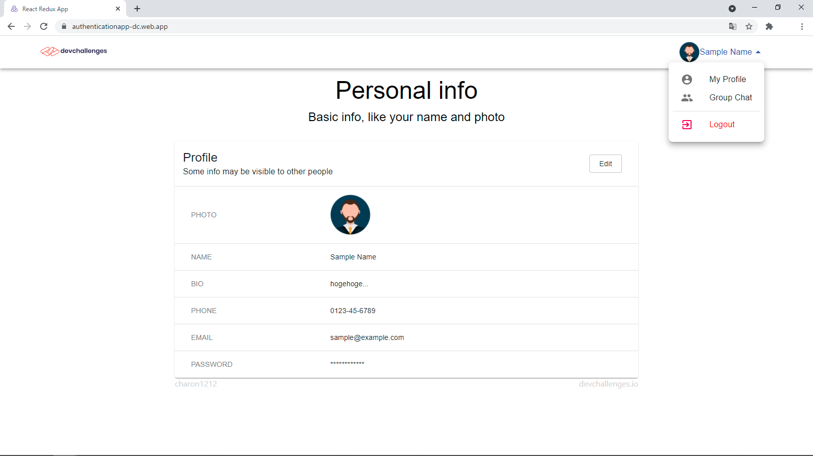

<!-- Please update value in the {}  -->

<h1 align="center">Authentication App</h1>

<div align="center">
   Solution for a challenge from  <a href="http://devchallenges.io" target="_blank">Devchallenges.io</a>.
</div>

<div align="center">
  <h3>
    <a href="https://authenticationapp-dc.web.app/">
      Demo
    </a>
    <span> | </span>
    <a href="https://{your-url-to-the-solution}">
      Solution
    </a>
    <span> | </span>
    <a href="https://devchallenges.io/challenges/N1fvBjQfhlkctmwj1tnw">
      Challenge
    </a>
  </h3>
</div>

<!-- TABLE OF CONTENTS -->

## Table of Contents

- [Overview](#overview)
  - [Built With](#built-with)
- [Features](#features)
- [How to use](#how-to-use)
- [Acknowledgements](#acknowledgements)
- [Contact](#contact)

<!-- OVERVIEW -->

## Overview



You can see demo to access <https://authenticationapp-dc.web.app>. For more information, see [this article]() (written in Japanese).

### Built With

- [React](https://reactjs.org/)
- [TypeScript](https://www.typescriptlang.org)
- [Firebase](https://firebase.google.com)

## Features

This application/site was created as a submission to a [DevChallenges](https://devchallenges.io/challenges) challenge. The [challenge](https://devchallenges.io/challenges/N1fvBjQfhlkctmwj1tnw) was to build an application to complete the given user storie.

## How To Use

### run app

To clone and run this application, you'll need [Git](https://git-scm.com) and [Node.js](https://nodejs.org/en/download/) (which comes with [npm](http://npmjs.com)) installed on your computer. From your command line:

```bash
# Clone this repository
$ git clone https://github.com/charon1212/authentication_app_devchallenges.git

# Install dependencies
$ npm install

# Run the app
$ npm run start
```

### connect backend

In order to connect backend, you should ...

1. make firebase project.
1. make .env file in your project root directory.  
[/src/app/firebase/firebase.ts](https://github.com/charon1212/ImageUploader_devchallenges/blob/main/src/app/firebase/firebase.ts) include firebase settings.  
(See .env.example and <https://firebase.google.com/docs/web/setup#add-sdks-initialize>)
1. set firebase storage's security rule like below:

```javascript
rules_version = '2';
service cloud.firestore {
  match /databases/{database}/documents {
    match /users/{userId}{
      allow read, write: if request.auth != null && request.auth.uid == userId;
    }
  }
}
```

## Acknowledgements

- Sample avatar used in screenshot is [Designed by studiogstock / Freepik](http://www.freepik.com)

## Contact

- Mail <charon1212.teq@gmail.com>
- GitHub [@charon1212](https://github.com/charon1212)
- Twitter [@charon91179134](https://twitter.com/charon91179134)
